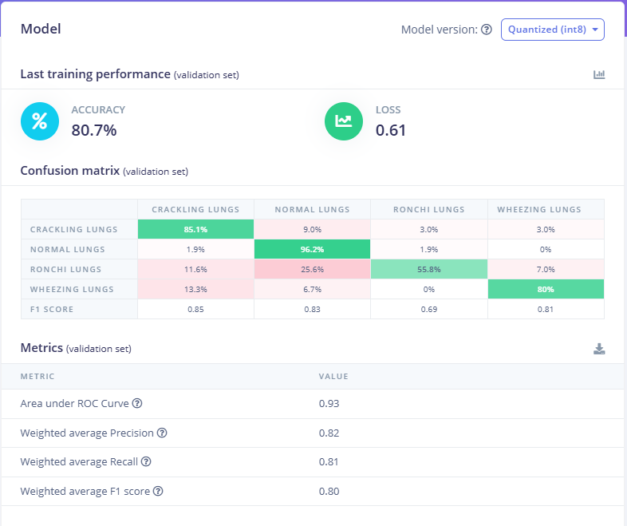

# Project VITALIS: AI-Driven Acoustic Triage Node
**An Edge-AI Stethoscope Attachment for Rapid Pulmonary Diagnostics**

## 👥 Development Team
* **Pradhumya Singh Yadav**
* **Dhairya Chaudhary**
* **Aryan Chauhan**
---

## 🩺 Executive Summary
**VITALIS** (Ventilation & Internal Lung Integrated System) is an ultra-low-cost, offline Artificial Intelligence diagnostic tool. It is engineered as a modular T-junction attachment that retrofits onto any standard analog stethoscope. 

By capturing acoustic pulmonary data and processing it locally via Edge-AI, VITALIS identifies respiratory anomalies (Wheezes, Crackles, Rhonchi) in real-time. It is specifically designed to empower NGO field workers and frontline health staff in resource-depleted environments to perform rapid triage without requiring an internet connection or an on-site pulmonologist.

---

## 🌍 Alignment with UN Sustainable Development Goals (SDGs)
This project is purpose-built to address the "Last Mile" healthcare gap, actively targeting three primary UN SDGs:

### 1. SDG 3: Good Health and Well-being
* **The Problem:** Respiratory diseases (like Pneumonia and Asthma) are leading causes of mortality in rural areas due to misdiagnosis by untrained staff.
* **The VITALIS Solution:** By providing an automated, 80.7% accurate "second opinion" for lung auscultation, VITALIS facilitates early detection and timely medical intervention, directly working to reduce preventable mortality.

### 2. SDG 9: Industry, Innovation, and Infrastructure
* **The Problem:** Commercial digital stethoscopes are prohibitively expensive and rely on cloud computing, rendering them useless in rural infrastructure.
* **The VITALIS Solution:** Innovates by utilizing decentralized "Edge Computing." By running quantized int8 neural networks directly on a $4 ESP32 microcontroller, it brings cutting-edge Deep Learning infrastructure to grassroots levels, functioning with zero internet latency.

### 3. SDG 10: Reduced Inequalities
* **The Problem:** There is a severe disparity in diagnostic quality between urban hospitals and rural clinics.
* **The VITALIS Solution:** Democratizes advanced medical technology. By upgrading a standard $10 analog stethoscope into a digital diagnostic node using affordable MEMS microphones, it ensures that underserved populations receive a standard of care closer to that of urban centers.

---

## ⚙️ System Architecture & Workflow
VITALIS operates on a completely localized, closed-loop pipeline ensuring 100% patient data privacy.

1. **Acoustic Coupling:** Analog lung sounds are captured via the stethoscope chest-piece and routed through a custom 3D-printed/PVC T-junction.
2. **Digital Conversion:** The **INMP441 I2S MEMS Microphone** samples the audio at high fidelity, converting acoustic waves into digital I2S data streams.
3. **DSP & Feature Extraction:** The **ESP32** buffers the audio in 1000ms windows and calculates Mel Frequency Cepstral Coefficients (MFCC) to isolate the acoustic "fingerprints" of the breath.
4. **AI Inference:** The extracted features are fed into the quantized TensorFlow Lite / Keras neural network.
5. **Output UI:** The predicted respiratory state is immediately displayed on the **0.96" I2C OLED**, providing clear triage instructions to the operator.

---

## 🧠 Neural Network Performance
The core inference engine was trained via Edge Impulse on a clinically verified dataset. 

### Validation Metrics
* **Overall Accuracy:** 80.7%
* **Normal Lung Precision:** 96.2%
* **Training Depth:** 600 Epochs
* **Optimization:** Quantized (int8) to operate within the 320KB RAM constraints of the ESP32.

### Evidence of Training

> *Figure 1: Confusion Matrix validating the model's high reliability in identifying healthy vs. anomalous respiratory cycles.*

---

## 🛠️ Hardware Bill of Materials (BOM)
* **Microcontroller:** ESP32 DevKit V1 (38-pin Type-C, Xtensa LX6 @ 240MHz)
* **Acoustic Sensor:** INMP441 I2S Digital MEMS Microphone
* **Display Interface:** 0.96" I2C OLED (SSD1306)
* **Physical Hardware:** Standard Analog Stethoscope + Custom Modular T-junction

---

## ⚖️ Intellectual Property & Licensing

### **Non-Commercial License**
This project is licensed under the **Creative Commons Attribution-NonCommercial-ShareAlike 4.0 International (CC BY-NC-SA 4.0)**.
Under this license, others may share and adapt this material under the strict conditions of providing **Attribution** to the development team, ensuring **Non-Commercial** use, and distributing any modifications under the same **ShareAlike** license.

### **Patent & Prior Art Notice**
The Lead Developer reserves the right to file for **Patent Protection** regarding the unique hardware integration, acoustic coupling mechanism, and specific neural network architecture described in this repository. This public disclosure serves as **Prior Art** under international patent law, preventing unauthorized third-party patent claims.

---

## 📂 Dataset Attribution
The AI model was trained using the HLS-CMDS dataset. Per the author's requirements, all derivative works must cite the following:
> **Citation:** Y. Torabi, S. Shirani and J. P. Reilly, "Descriptor: Heart and Lung Sounds Dataset Recorded from a Clinical Manikin using Digital Stethoscope (HLS-CMDS)," in IEEE Data Descriptions, 2025. © 2024 Yasaman Torabi.

---
**Institution:** Jagran Public School, Noida  
**Submission:** CBSE Class 12 Artificial Intelligence Practical (2026-27)